

# Teoria dos Grafos e Aplicações

__Prof. Eduardo Ono__

&nbsp;

## Descrição

* Introdução à Teoria dos Grafos, aplicações e implementação computacional.

&nbsp;

## Binder

* https://mybinder.org/v2/gh/eduardo-ono/Teoria-dos-Grafos-e-Aplicacoes/main

&nbsp;

## [Conteúdo Programático](./conteudo-teoria/README.md)

| Aula | Data | Descrição |
| :-:  | :-:  | --- |
| 01 | 11/08 | Apresentação da disciplina; Introdução à Teoria dos Grafos; Aplicações; História da Teoria dos Grafos; [Problema das sete pontes de Königsberg]; Fundamentos de Lógica.
| 02 | 18/08 | Ambiente de desenvolvimento; [Fundamentos da programação em Python].
| 03 | 25/08 | [Conceitos básicos e terminologias]: grafo, subgrafos, grafos rotulados e valorados; Representação de grafos: Diagrama gráfico, matriz de adjacências, matriz de incidência e lista de adjacências.
| 04 | 01/09 | Percursos em grafos; Algoritmos de busca: Busca em largura (BFS) e busca em profundidade (DFS).
| 05 | 08/09 | Algoritmos de busca: Busca em profundidade (DFS); Conexidade, conectividade e problemas de caminhos.
| 06 | 14/09 | Caminhos de custo mínimo; Algoritmos de Dijkstra, Bellman-Ford e Floyd-Warshall.
|    | 29/09 | __1ª Avaliação__
| 07 | 13/10 | [Conceitos de percurso (passeio), caminho, ciclo (circuito)]; [Grafos e circuitos Eulerianos]; Algoritmo de Fleury.
| 08 |   | Problema do Carteiro Chinês
| 09 |   | Grafos e circuitos Hamiltonianos
| 10 |   | Problema do Caixeiro Viajante
| 11 |   | Planicidade (Grafos planares); Teorema de Kuratowsky
| 12 |   | Coloração de mapas; Teorema das quatro cores
| 13 |   | Árvores e árvore geradora mínima
| 14 |   | Fluxos em Redes

[Problema das sete pontes de Königsberg]: ./conteudo-teorico/01-introducao/problema-das-sete-pontes-de-konigsberg.ipynb
[Fundamentos da programação em Python]: https://github.com/eduardo-ono/Programacao-em-Python
[Conceitos básicos e terminologias]: ./conteudo-teorico/03-conceitos-basicos/README.md
[Conceitos de percurso (passeio), caminho, ciclo (circuito)]: ./conteudo-teorico/05-conexidade/README.md
[Grafos e circuitos Eulerianos]: ./conteudo-teorico/07-grafos-eulerianos/README.md

&nbsp;

## Pré-Requisitos

* Introdução à Programação
* Estrutura de Dados

&nbsp;

## Recursos

* https://graphclasses.org

* https://cmps-people.ok.ubc.ca/ylucet/DS/Algorithms.html

* https://colab.research.google.com

* https://networkx.org/documentation/stable/reference/index.html

* NetworkX: https://walkenho.github.io/graph-theory-and-networkX-part1/

* LaTeX: https://www.caam.rice.edu/~heinken/latex/symbols.pdf

&nbsp;

## Bibliografia Básica

| Capa | Descrição |
| :-: | --- |
| 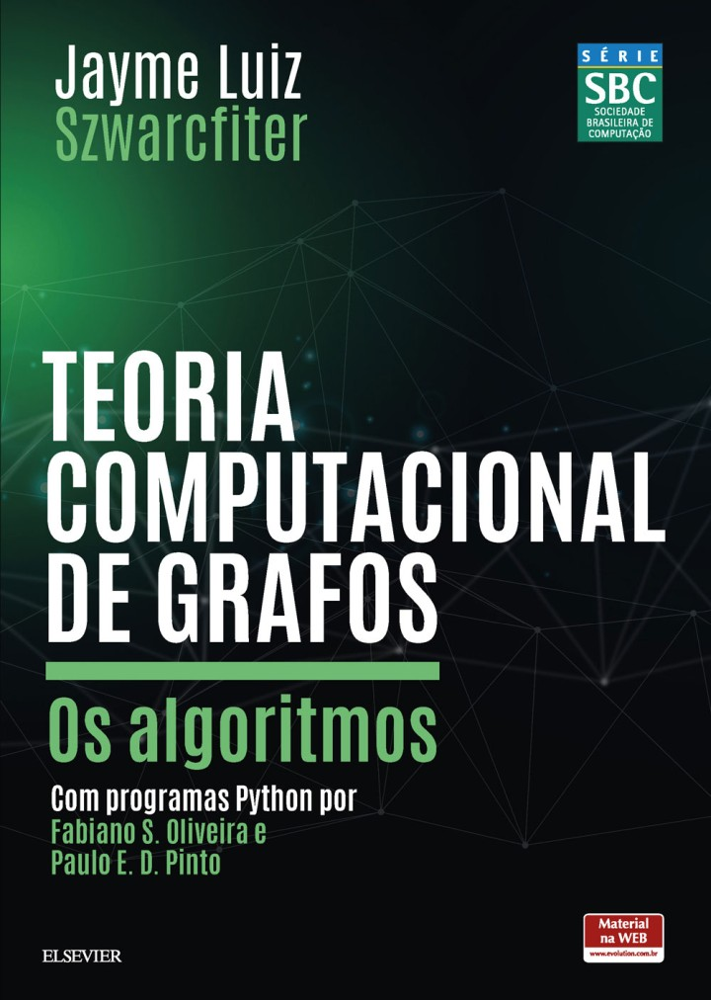 | [SZWARCFITER_2018] SZWARCFITER, Jayme Luiz; __Teoria Computacional de Grafos: Os Algoritmos__. 1. ed., GEN LTC, 2018[.](https://app.box.com/s/ujzgpss9vwwcd6mooqymvb82cgk0v8kv)
| 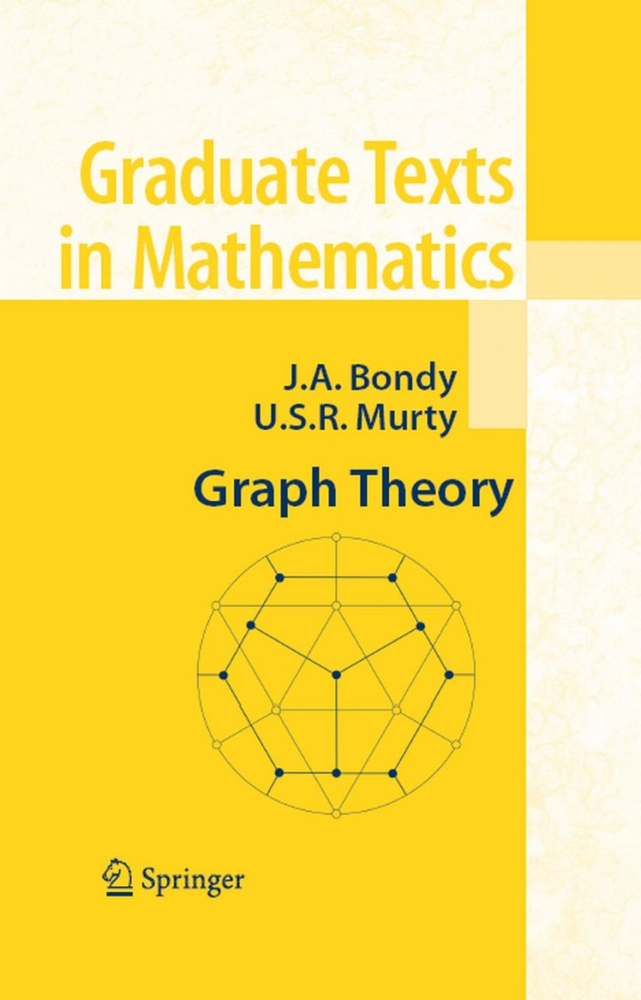 | [BONDY_2007] BONDY, J. A.; MURTY, U. S. R.; __Graph Theory__. 1. ed., 2007[.](https://app.box.com/s/uq849jzthntp42e0bhwez7m8xyz3chme)
| 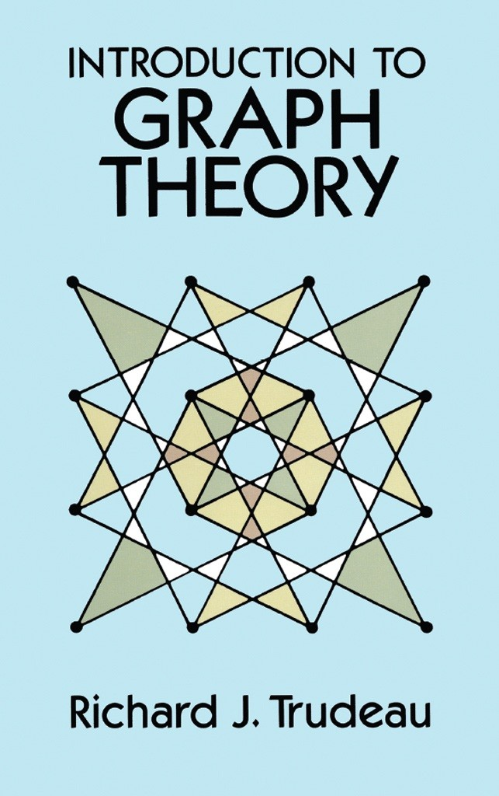 | [TRUDEAU_1993] TRUDEAU, Richard J. <strong>Introduction to Graph Theory</strong>.  1. ed. Cidade: Editora, Ano[.](#) Resenha: https://www.youtube.com/watch?v=dJL4_p4f2Qg
| 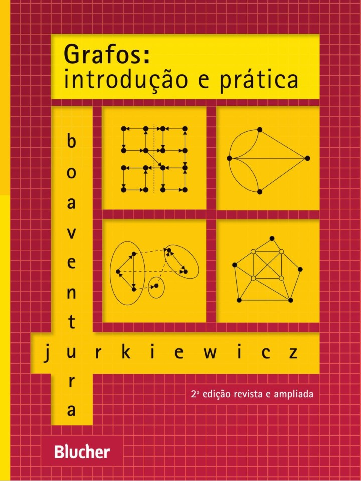 | [BOAVENTURA-NETTO_2017] BOAVENTURA NETTO, Paulo Oswaldo; JURKIEWICZ, Samuel. <strong>Grafos: Introdução e Prática</strong>. 2. ed. São Paulo: Blucher, 2017[.](#) Online: https://plataforma.bvirtual.com.br/Acervo/Publicacao/177879
| 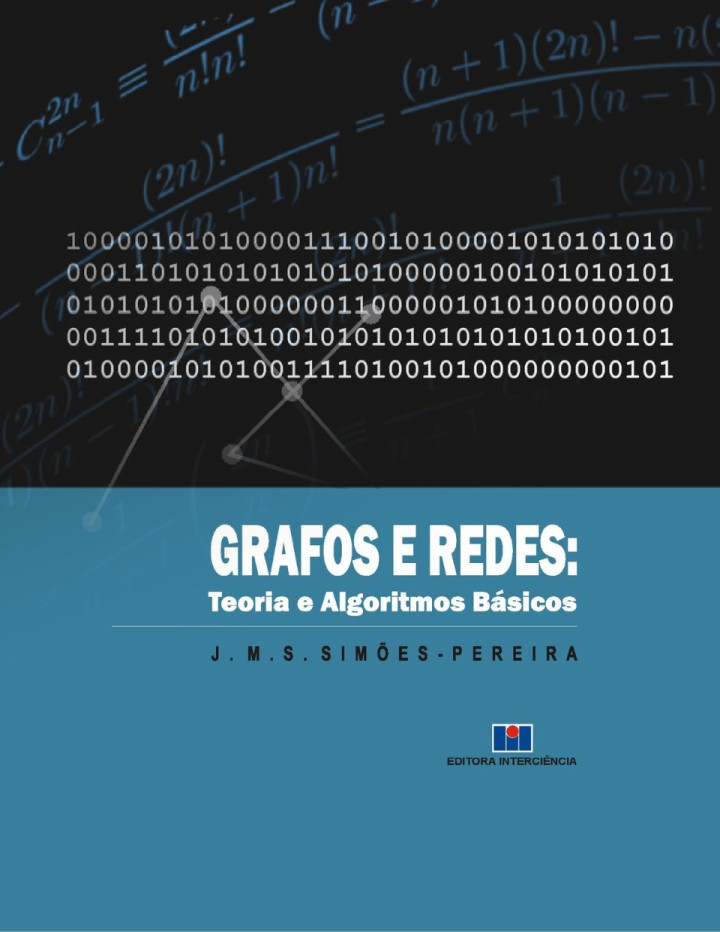 | [SIMOES-PEREIRA_2013] SIMÕES-PEREIRA, J. M. S. <strong>Grafos e Redes: Teoria e Algoritmos Básicos</strong>. 1. ed. Rio de Janeiro: Interciência, 2013[.](#) Online: https://plataforma.bvirtual.com.br/Acervo/Publicacao/42049

&nbsp;

## Bibliografia Complementar

| Capa | Descrição |
| :-: | --- |
| 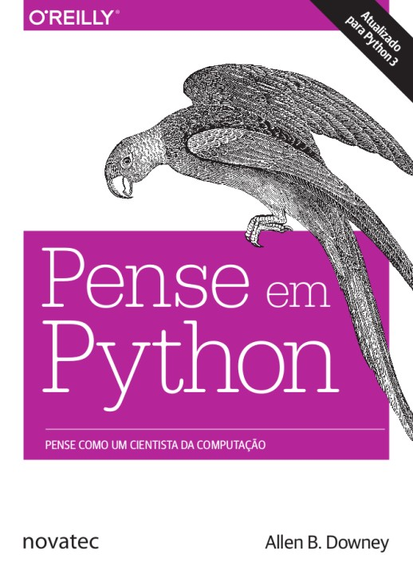 | [DOWNEY-2e_2016] DOWNEY, Karin R. <strong>Pense em python: Pense como um cientista da computação</strong>. 1. ed. Boca Raton: Taylor & Francis, 2017. epub: https://github.com/PenseAllen/PensePython2e/raw/master/ebooks/PenseEmPython2e.epub
| 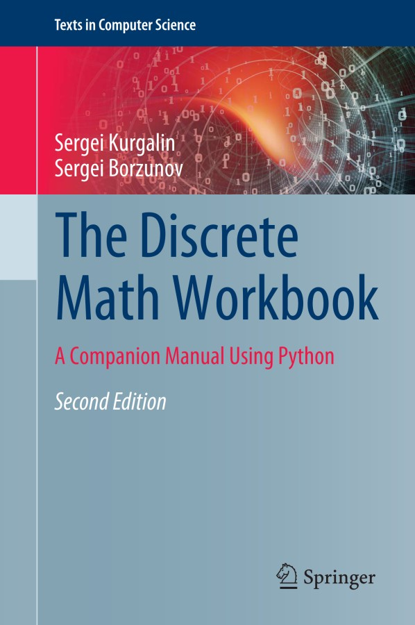 | [KURGALIN-2e_2020] KURGALIN, Sergei; BORZUNOV, Sergei. __The Discrete Math Workbook__. 2. ed., 2020.
| 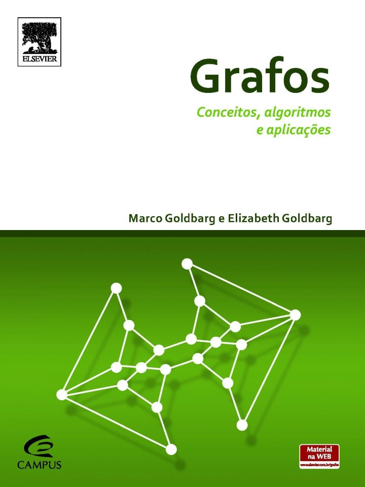 | [GOLDBARG_2012] GOLDBARG, Marco Cesar; GOLDBARG, Elizabeth. [__Grafos: conceitos, algoritmos e aplicações__. 1. ed.](https://livrariapublica.com.br/grafos-elizabeth-goldbarg-2/) Rio de Janeiro: Elsevier, 2012[.](#)
| 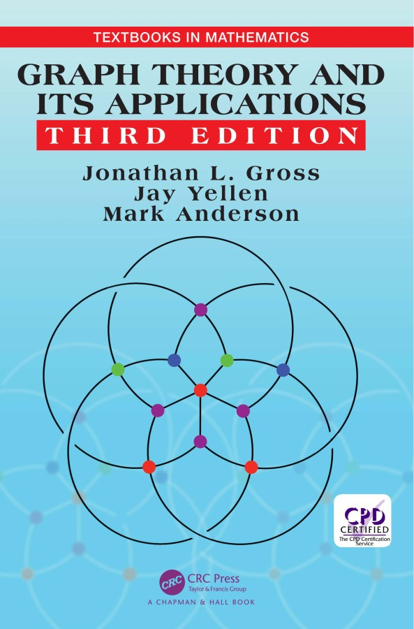 | [GROSS_2019] GROSS, Jonathan L.; YELLEN, Jay; ANDERSON, Mark. __Graph Theory and Its Applications__,  1. ed. Cidade: Editora, Ano[.](#) 
| 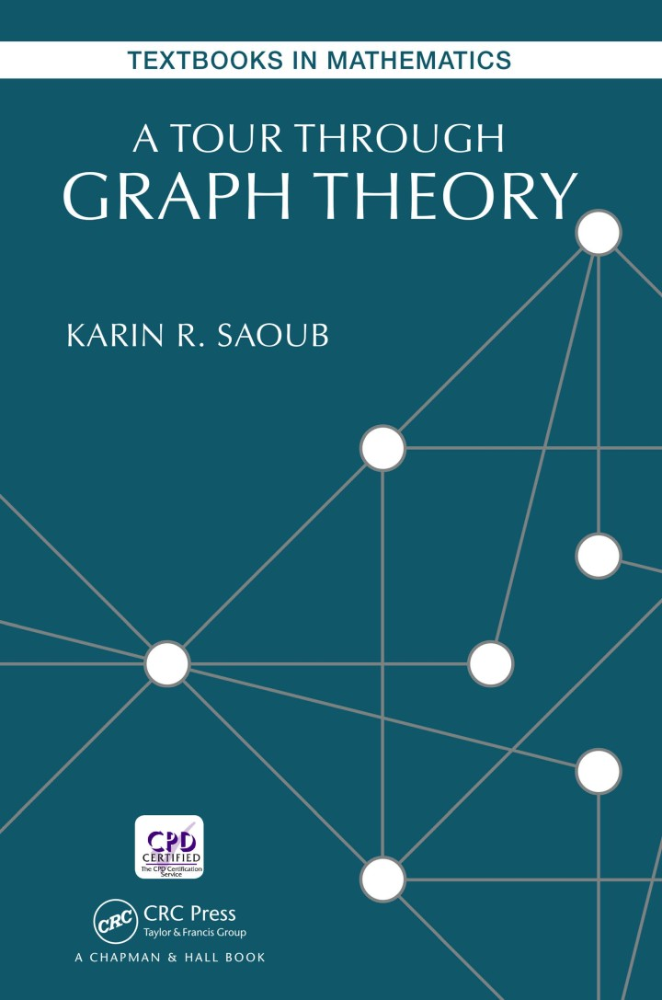 | [SAOUB_2017] SAOUB, Karin R. <strong>A Tour Through Graph Theory</strong>. 1. ed. Boca Raton: Taylor & Francis, 2017[.](#)
|  | [_2019] . <strong>Problemas Clássicos da Computação com Python</strong>. 1. ed. , 2019[.](#)
| 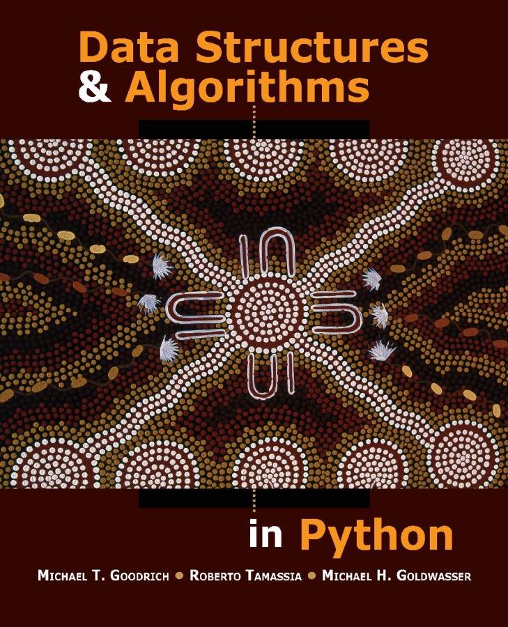 | [GOODRICH_2013] Data Structures and Algorithms in Python. 1. ed., 2013[.](http://xpzhang.me/teach/DS19_Fall/book.pdf)
| 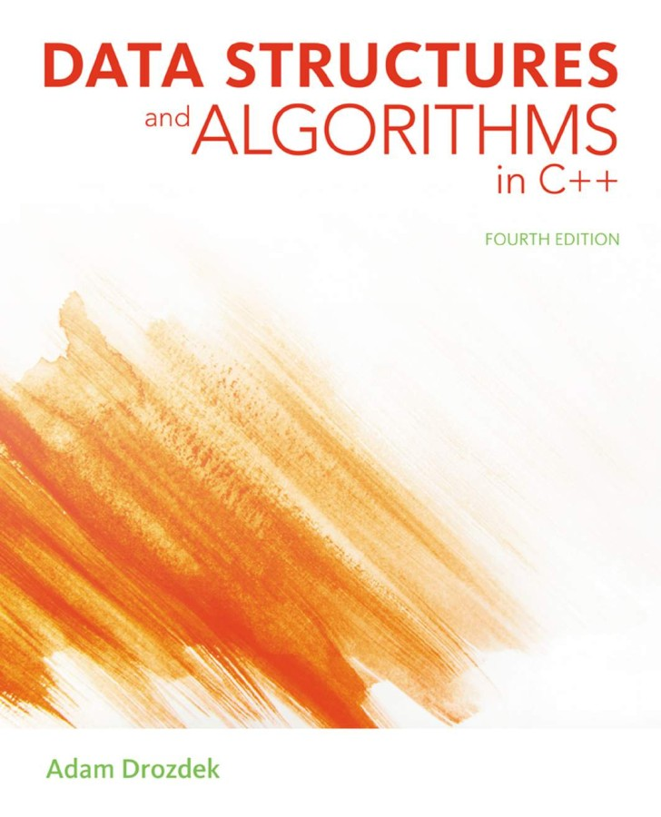 | [DROZDEK-4e_2012]  __Data Structures and Algorithms in C++__. 4. ed. Cengage Learning, 2012[.](#)
| 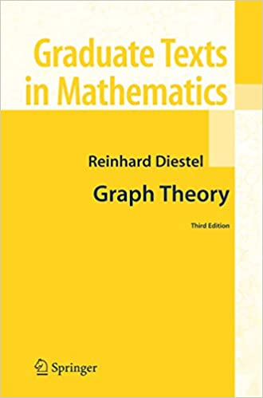 | [DIESTEL-3e_2005]  __Graph Theory__. 3. ed., 2005[.](https://sites.math.washington.edu/~billey/classes/562.winter.2018/articles/GraphTheory.pdf)

&nbsp;

## Vídeos Recomendados

| Thumb | Descrição |
| :-: | --- |
|  | [Reducible] [__Introduction to Graph Theory: A Computer Science Perspective__](https://www.youtube.com/watch?v=LFKZLXVO-Dg) (16:25, YouTube, Jun/2020)
|  | [Ciência Todo Dia] [__O Problema de 1 MILHÃO de DÓLARES__](https://www.youtube.com/watch?v=9WwYO1Jtr7Y) (13:20, YouTube, Set/2021)
|  | [Reducible] [__PageRank: A Trillion Dollar Algorithm__](https://www.youtube.com/watch?v=JGQe4kiPnrU) (25:25, YouTube, Mai/2022)

&nbsp;

## Filmes e Documentários Recomendados

| Thumb | Descrição |
| :-: | --- |
|  | [__The Man Who Knew Infinity__](https://www.youtube.com/watch?v=8WwLPep9xNg) (2015) / O Homem que Viu o Infinito (1:48:35, YouTube, Jan/2020)
|  | [__Good Will Hunting__](https://www.youtube.com/watch?v=-ViPmcdlfbQ) (1997) / Gênio Indomável (4:16, YouTube, Abr/2020)
|  | [Andrew Rozario] [__The Right Match: A Short Documentary__](https://www.youtube.com/watch?v=ttMQECKQ3DQ) (21:42, YouTube, Nov/2013)
|  | [Cederj : Tec em Sistemas de Computação : UFF] [__Matemática e computação: uma união estável__](https://www.youtube.com/watch?v=YZk4n6oHLA0) (22:39, YouTube, Abr/2018) |

&nbsp;
