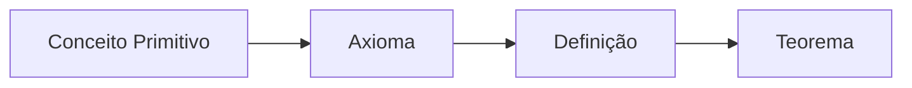

## Sistema Axiomático

O sistema começa com os __*conceitos primitivos*__, que são óbvios (auto evidentes) através de uma simples observação.

Os axiomas (ou postulados) são as conclusões evidentes dos conceitos primitivos.

Derivando para as definições, temos que elas são informações mais elaboradas que servem como explicação para novos elementos de uma determinada teoria.

Por fim, o teorema é a informação mais complexa, já que ele envolve todo o raciocínio das informações anteriores, além de possuir uma aplicação mais concreta. Nesse sentido, todo teorema deve possuir uma explicação mais completa e detalhada, ou seja, uma demonstração.

 

## Elementos do Sistema Axiomático

### Conceito

> Do latim _conceptus_, do verbo _concipere_, que significa "conter completamente", "formar dentro de si“.
O __*conceito*__ é aquilo que a mente concebe ou entende; é uma ideia ou uma noção.

### Conceitos Primitivos

* Exemplos (Geometria Plana)

  * Ponto
  * Reta
  * Plano

* Como estes elementos são elementares, eles não possuem definição.

### Definição

> Uma __*definição*__ é um enunciado que descreve um conceito.

* Exemplo

  * sdcds

### axioma

> Do grego _axioma_, consideração, estima, opinião, dogma. Diz-se das verdades gerais, aceitas sem discussão ou consideradas evidentes por si próprias, como na Filosofia e na Matemática.

> Na matemática, um _axioma_ é uma hipótese inicial de qual outros enunciados são logicamente derivados. Pode ser uma sentença, uma proposição, um enunciado ou uma regra que permite a construção de um sistema formal. Diferentemente de teoremas, axiomas não podem ser derivados por princípios de dedução e nem são demonstráveis por derivações formais, simplesmente porque eles são hipóteses iniciais. Isto é, não há mais nada a partir do que eles seguem logicamente (em caso contrário eles seriam chamados teoremas). Em muitos contextos, "axioma", "postulado" e "hipótese" são usados como sinônimos.

* Exemplos (Geometria Euclidiana)

    * Existe ponto, existe reta e existe plano.

    * Na reta (e também fora dela) existem infinitos pontos;

    * Dois pontos distintos determinam uma, e somente uma, reta;

    * Três pontos que não são colineares determinam um único plano que os contém;

    * A menor distância entre dois pontos é o segmento de reta que une estes dois pontos;

* Exemplos (Axiomas de Euclides)

  * Axioma 1: Duas coisas iguais a uma terceira, são iguais entre si.

  * Axioma 2: Se parcelas iguais forem adicionadas a quantias iguais, os resultados continuarão sendo iguais.

  * Axioma 3: Se quantias iguais forem subtraídas das mesmas quantias, os restos serão iguais.

  * Axioma 4: Coisas que coincidem uma com a outra, são iguais.

  * Axioma 5: O todo é maior que a parte.

### Lema

> Na Matemática, um _lema_ é um teorema que é utilizado como um passo intermediário para provar outro teorema mais importante que lhe sucede. Normalmente o lema tem pouca serventia além de servir ao propósito do teorema que o utiliza, mas isto não é uma regra, e a classificação entre lemas e teoremas é arbitrária.

### Corolário

> Um corolário (do latim tardio corollarĭum) é uma afirmação deduzida de uma verdade já demonstrada.[1] Assim como proposição resultante de uma verdade.

* Exemplo

* É igualmente uma decorrência imediata de um teorema. Por exemplo, o comprimento da diagonal de um quadrado cujo lado possui comprimento a é dado por a ⋅ &sqrt;2}. Isso é um corolário do teorema de Pitágoras.

### Teorema

