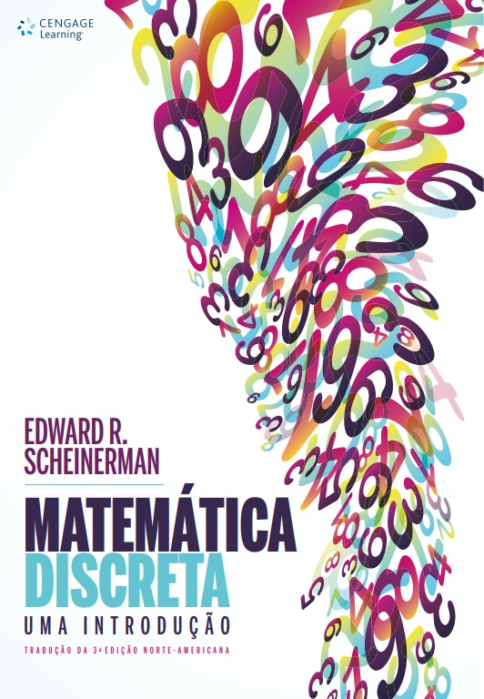

<h1 align="center">Coloração de Grafos</h1>

<h4 align="center">Prof. Eduardo Ono</h4>

&nbsp;

## Tópicos

&nbsp;

## Referências

| Capa | Descrição |
| :-: | --- |
|  | [SCHEINERMAN-3e_2016] SCHEINERMAN, Edward R.; Matemática discreta: uma introdução, trad. 3. ed., São Paulo: Cengage Learning, 2016[.](https://app.box.com/s/tkqyn1e9jr8bafggx34zi8l1c67a0ygx)

&nbsp;
